# justdooeet! – Todo List App 📝

**justdooeet!** is a responsive, offline-capable Todo List web application built with **VueJS** and **Typescript**. It fetches data from the [DummyJSON Todos API](https://dummyjson.com) and enhances it with features like local persistence, task editing, filtering, and progress visualization.

---

## 🚀 Features

- 🔁 **Hybrid Data Source**: Fetches todos from DummyJSON API and combines them with local todos.
- ✏️ **Extended Fields**: Adds priority, description, and date fields stored in `localStorage`.
- ✅ **CRUD Operations**: Add, edit, delete, and complete todos—both online and offline.
- 🔍 **Search & Filter**: Filter todos by status (completed/incomplete) and search by text.
- 📦 **Query Caching & Offline Sync**: Uses **React Query** + **TanStack Query Persister** with `localforage`.
- 🔄 **Pagination**: Displays 10 tasks per page with navigation and mobile-friendly design.
- 🗑️ **Drag-and-Drop Delete**: Delete todos by dragging them into a trash area.
- 📊 **Progress Summary**: Visual bar showing percentage of completed vs pending tasks.
- 🧩 **Modular Design**: Uses `Dialog` modals for add/edit actions via ShadCN.
- ♿ **Accessibility**: Full keyboard navigation and ARIA support.
- 📱 **Responsive Layout**: Optimized for desktop, tablet, and mobile screens.
- **justaskeet**: A chatbot powered by Gemini AI to answer FAQs regarding the app.


## justaskeet!

This new feature serves as an interactive guide designed to assist users with questions about the app and its various functionalities. Powered by the Gemini AI 2.5 Pro model, it provides helpful and accurate answers focused primarily on to-do management. To ensure continuous support, a fallback mechanism using Fuse.js handles common to-do related questions whenever justaskeet! is unavailable—whether due to network issues or usage limits on the AI service tier. API requests and authentication are securely managed using Google Cloud credentials to ensure data privacy and protection.


## 🧭 Pages Overview

`/dashboard`     Main todo list with filters, pagination, and controls 
`/todo/:id`      Detailed view of individual todo item           
 `/categories`   Manage and assign categories to todos           
                  


## 🛠 Installation & Setup

1. **Clone the repository**:
   ```bash
   git clone https://github.com/yourusername/todo-list-app.git
   cd todo-list-app
   ```

2. **Install dependencies**:
   ```bash
   npm install
   ```

3. **Start the development server**:
   ```bash
   npm run dev
   ```

4. **View the app**:
   Open your browser and navigate to:
   ```
   http://localhost:5173
   ```

---

## 📦 Available Scripts

| Command           | Description                                 |
|------------------|---------------------------------------------|
| `npm run dev`     | Run in development mode with hot reloading  |
| `npm run build`   | Build the app for production                |
| `npm run preview` | Preview the production build                |
| `npm test`        | Run tests (if configured)                   |
| `npm run lint`    | Lint the project (if linter configured)     |

---

## 🧱 Tech Stack & Architecture

- **Vuejs + Vite** – Lightning-fast dev environment and optimized production build
- **Tanstack Query (@tanstack/vue-query)** – API caching, background refetching, state management
- **@tanstack/query-persist-client** – Persists React Query data to `localforage` for offline caching
- **localStorage** – Stores extended task fields (description, priority, etc.)
- **localforage** – Async persistent storage used with Query Persister
- **Tailwind CSS** – Utility-first styling framework
- **ShadCN UI** – Accessible and consistent UI components (e.g., `Dialog`)
- **Sonner** – Toast notifications for UX feedback
- **Vue Drag and Drop** – Drag-and-drop to delete tasks
- **DummyJSON API** – Simulated todo API for read/write operations
- **Fuse JS** - To support the chatbot
- **Vue Markdown** - For text within the chatbot

---

## 🔌 API Usage

**DummyJSON Todos API**

- `GET /todos?limit=100` – Fetch up to 100 todos
- `PUT /todos/:id` – Update todo (e.g. mark as completed)
- `DELETE /todos/:id` – Delete a todo by ID

> API data is merged with local todos, and extended fields are stored locally by `todo.id`.

---

## 🖼 Screenshots / Demos

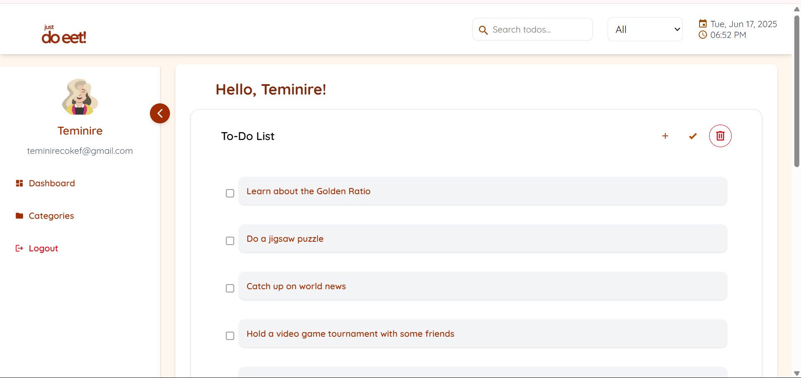
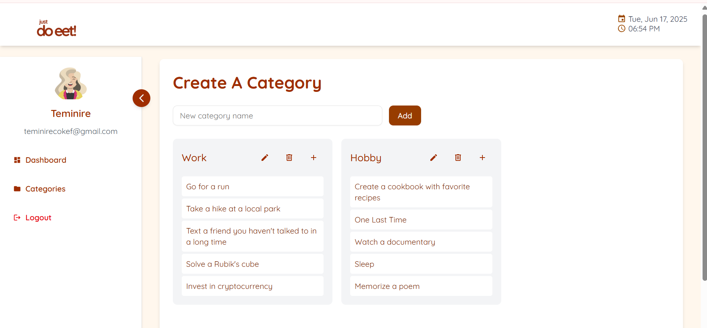
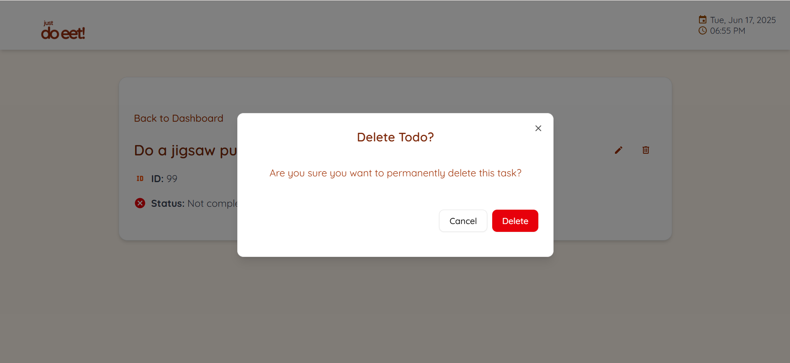
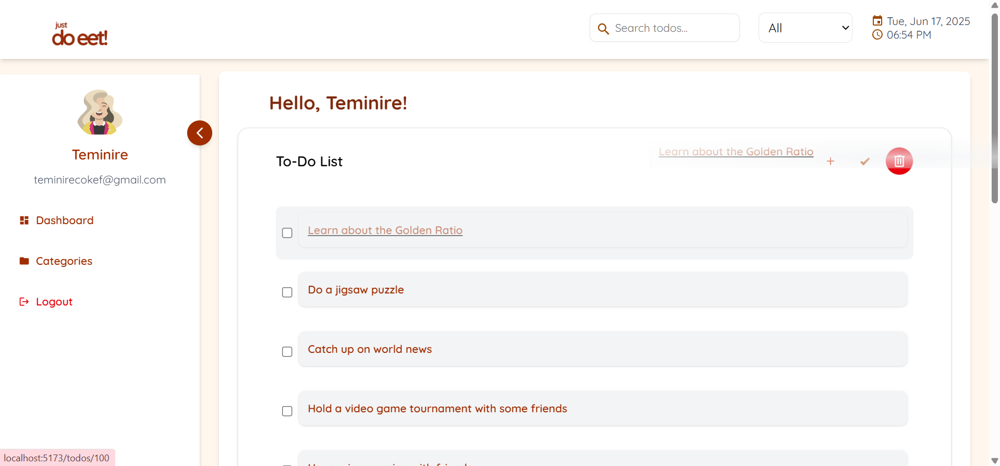
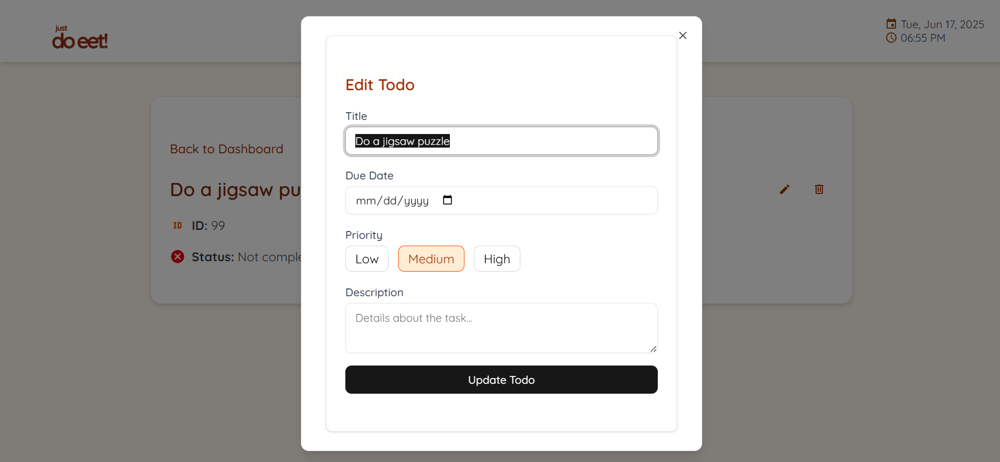
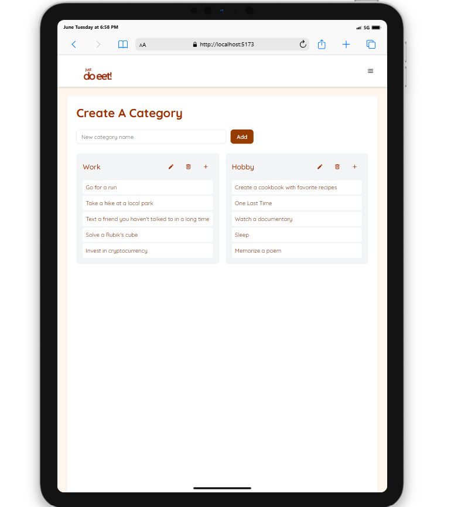

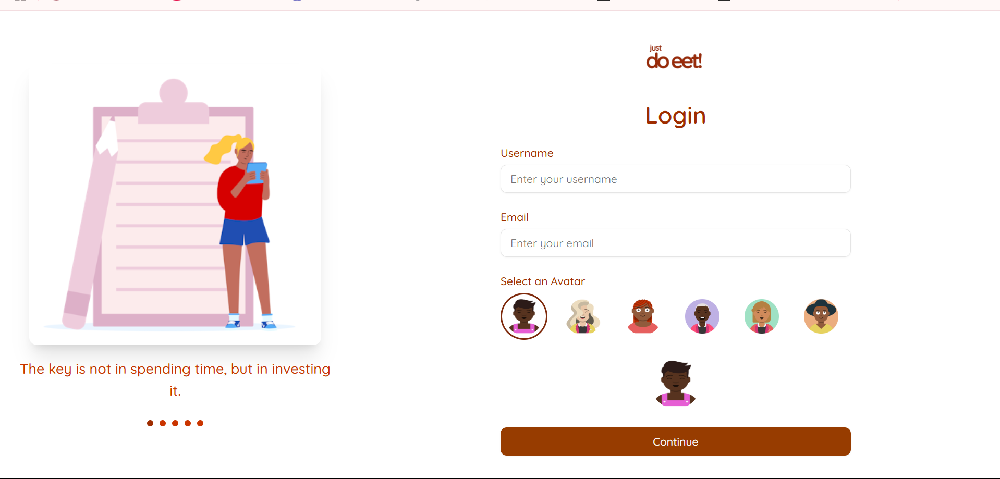
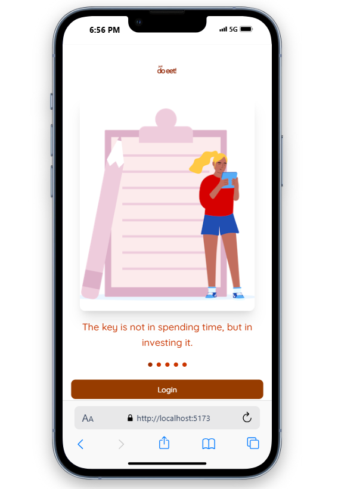
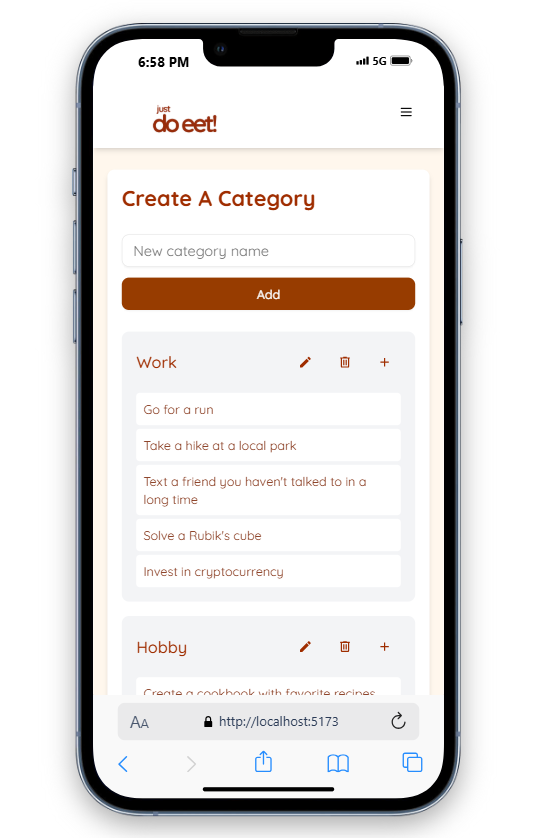

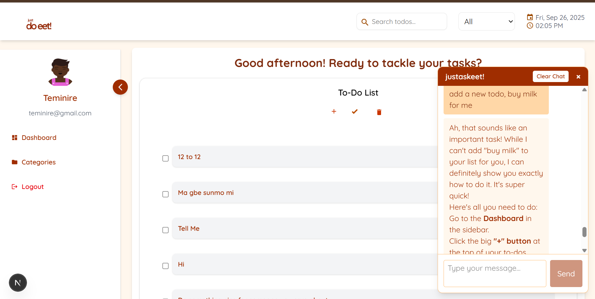
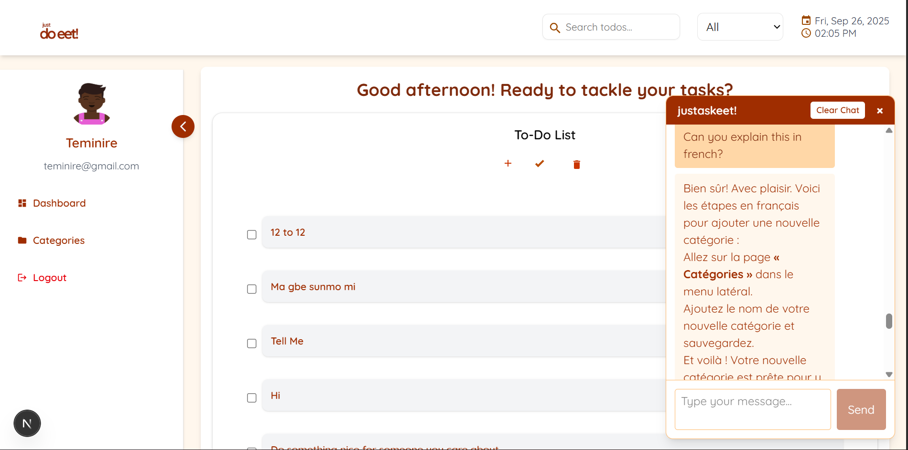
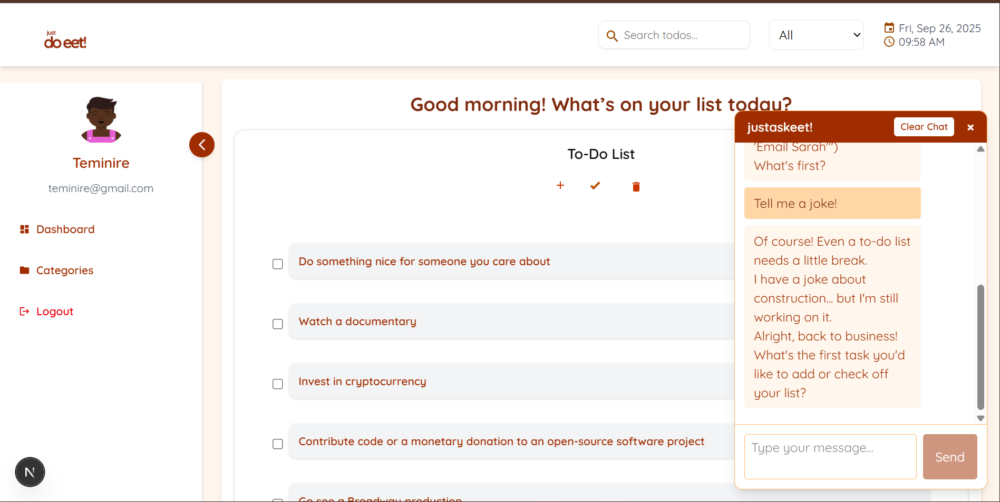
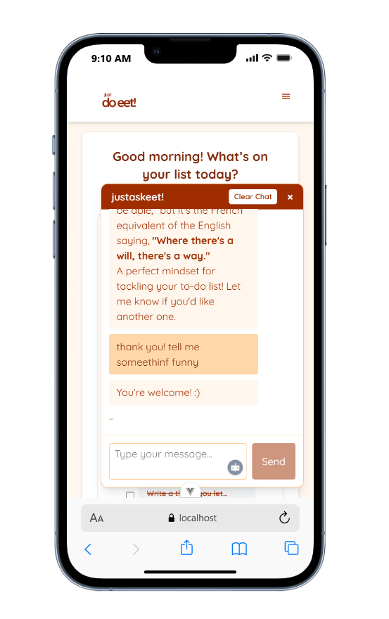


## ⚠ Known Issues / Limitations

-  **No authentication** – All data is publicly shared and session-based.
-  **API does not persist** – Changes to DummyJSON API do not persist beyond session.
-  **Offline sync is one-way** – Local changes do not auto-resync to API on reconnect.

---

## 📅 Future Improvements

- ✅ Better offline sync between API and local storage
- 📆 Enhanced calendar/reminder system
- 📦 Installable PWA support
- 🎨 More UI illustrations and animations
- 🧭 Advanced filters (by category, priority, etc.)
- 🎹 Keyboard shortcuts and accessibility polish
- 📱 Improved mobile and tablet responsiveness
- 🔔 Push notification support for reminders
- More robust features and wider FAQs for justaskeet chatbot

---

## ✅ Offline Availability

justdooeet! supports offline access to todos via:

- **localStorage** – Persists user-created todos and metadata.
- **localforage** + **TanStack Query Persister** – Caches fetched API todos so users can return to the app without internet.

> 🔁 Once loaded, todos remain available even after reload or disconnection.

---

## 👩‍💻 Author

> Built by Oluwatiseteminirere Coker 


